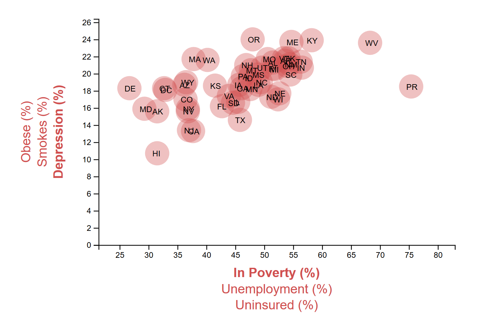

## Data Journalism
### 2014 Economic factors by State
#### Observations:

   * High correlation can be observed between % of population who are below poverty line and % of population those are suffering from Depression or can go under depression. Few of the states that suffered the most in 2014 from depression and below poverty line are West virginia and Puerto Rico.
   * There is seems to be linear correaltion between % of population unisured and those who are obese(Over weight). Another factor to be noted is Obesity is usally the higher rate amogst all the factors wheather they umemployed, uninsured or below poverty line.
   * There seems to be some correlation between % of population under poverty and obese. Puerto Rico have the highest level of Obesity rate and no employment.Puerto Rico also looks affected by high rate smoking.
 

#### X-axis Options:
* **In Proverty (%):** is the default x-axis option. It represents the % of total population who are below the proverty line.
* **Unemployment (%):** is the second x-axis option which represents the % of total population who are 16+ years and unemployed.
* **No Health Coverage(Uninsured) (%):** is the third x-axis option which represents the % of total population with having NO health coverage.

#### Y-axis Options:
* **Depression (%):** is the default y-axis option. It represents the % of total population that is suffering from Depression
* **Smokes(%):** is the second y-axis option which represents the % of total population who are daily smokers
* **Obesity(%):** is the third y-axis option which represents the % of total population who all are over weight (Obese)

